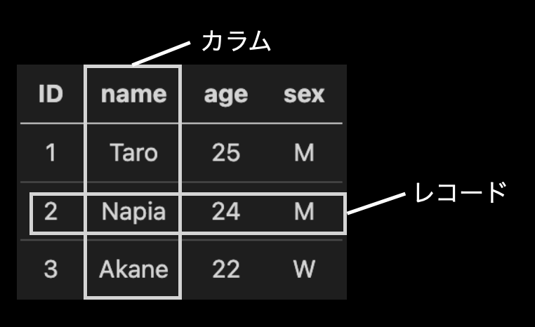

# [SQL]Basic gramer of SQL[Oct.16.2022]

## テーブル各部名称
[usersテーブル]


## クエリの基礎
 - `SELECT <カラム名>`:取得する対象カラム名の指定(","で複数指定可能)
 - `FROM <テーブル名>`:取得先のテーブル名の指定(* = ワイルドカード)<br>

[Sample] 
```
SELECT name, age
FROM users; //クエリの末尾にはセミコロン
```
<br>

 - `WHERE <条件式>`:条件を満たすレコードのみ取得する(文字列，日時は""で囲む)
 - `AND`/`OR`:複数条件がある場合に使う
 - `NOT`:〜でない時に使う
 - `LIKE`:~を含む(%をワイルドカードとして使い，前方一致，後方一致等を設定)
 - `IS NULL`/`IS NOT NULL`:空欄さがし/埋まっている欄探し

[Sample1]
```
SELECT *
FROM users
WHERE NOT ID = 2
AND sex = "W";
```
[Sample2]
```
SELECT *
FROM users
WHERE name LIKE "%a%" //"a"を含む
AND sex = "W";
```
[Sample3]
```
SELECT *
FROM users
WHERE name LIKE "N%" //"N"から始まる
AND sex IS NOT NULL;
```
<br>

 - `ORDER BY <カラム名> ASC/DESC`:並び替え(ASCで昇順, DESCで降順)
 - `LIMIT X`:上からX件取得(これは最後に書く)

[Sample]
```
SELECT *
FROM users
ORDER BY ID DESC
LIMIT 2;
```